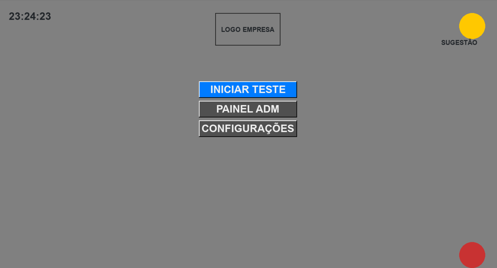
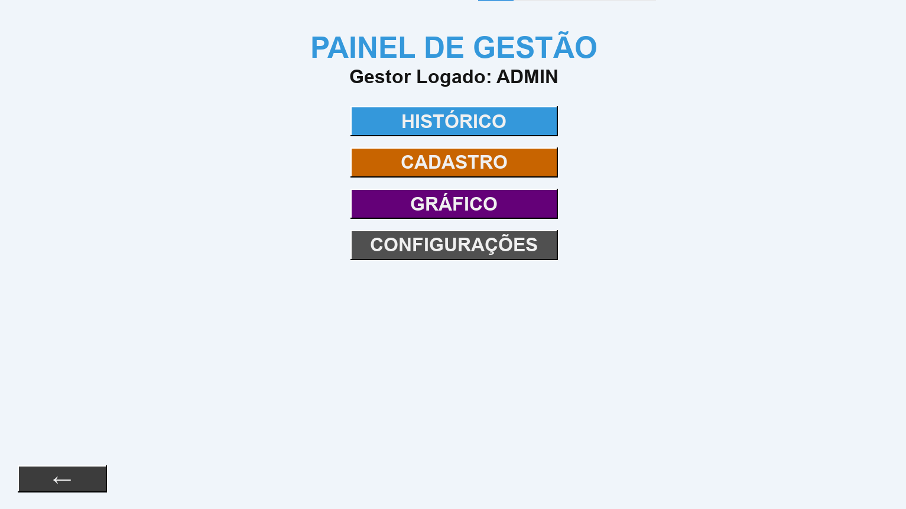
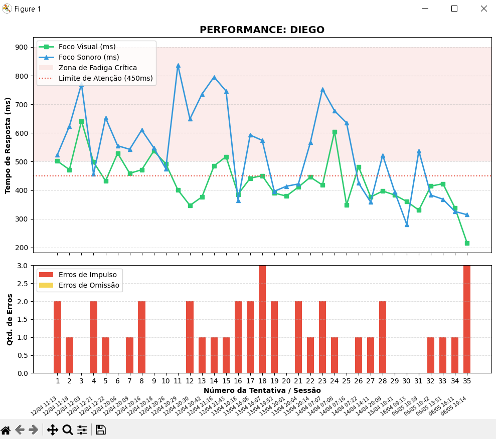

# Dashboard de Monitoramento de Fadiga Ocupacional 🧠🚗

## 🚧 Status do Projeto: Em Desenvolvimento (Fase de Refatoração)
*Atualmente, o projeto está passando por uma reestruturação de arquitetura para desacoplamento de componentes, visando otimizar o laço de eventos (Game Loop) e melhorar a precisão da coleta de telemetria de dados.*

---

## 📋 Sobre o Projeto
Este projeto é uma aplicação desktop desenvolvida em **Python** utilizando a biblioteca **Pygame**. O objetivo principal é avaliar e monitorar os níveis de fadiga e tempo de reação de operadores e trabalhadores antes de jornadas críticas (como motoristas de frotas ou operadores de maquinário pesado).

A aplicação utiliza o protocolo psicométrico **Go/No-Go**, disparando estímulos visuais e auditivos para medir:
- **Tempo de reação** em milissegundos.
- **Taxa de acerto/erro** sob pressão de tempo.
- **Índice de atenção sustentada**, correlacionando os dados com o histórico de sono relatado pelo usuário.

É uma solução que une a engenharia de segurança do trabalho à lógica de programação para mitigar riscos operacionais humanos.

---

## 📸 Demonstração Visual

Abaixo estão capturas de tela do sistema em execução:

### 1. Tela Inicial
> *]*
*Legenda: Interface de entrada, separação de hierarquia*

### 2. Interface de ADM
> *]*
*Legenda: Interface de ADM*


### 3. Dashboard de Análise (Fadiga x Sono)
> *]*
*Legenda: Gráficos gerados para correlacionar as horas de sono com as falhas de atenção do operador.*

---

## 🛠️ Tecnologias e Bibliotecas Utilizadas
- **Python 3.x**
- **Pygame:** Desenvolvimento da interface gráfica e gerenciamento do laço de eventos em tempo real.
- **Sys / OS:** Manipulação de arquivos de log do sistema.
- *(Opcional - caso use)* **Matplotlib / Pandas:** Para modelagem e plotagem de gráficos estatísticos.

---

## 📁 Estrutura de Arquitetos do Projeto
A arquitetura do projeto foi desenhada para separar recursos de mídia da lógica de execução:

```text
Teste-de-Fadiga/
│
├── assets/                 # Identidade visual, mídias e áudios do sistema
│   ├── fontes/             # Fontes de escrita personalizadas (.ttf)
│   ├── icon.ico            # Ícone do executável da aplicação
│   ├── som_go.wav          # Áudio de estímulo positivo
│   └── som_nogo.wav        # Áudio de estímulo negativo
│
├── backup/                 # Arquivos históricos e versões prévias de desenvolvimento
│
├── src/                    # Código-fonte principal da aplicação
│   ├── dashboard.py        # Módulo responsável pela tela de métricas e gráficos
│   └── teste_jogo.py       # Arquivo de entrada principal e motor do teste de reação
│
├── .gitignore              # Proteção contra envio de caches e binários do PyInstaller
└── requirements.txt        # Gerenciador de dependências do ambiente Python


Desenvolvido como projeto pessoal de Engenharia & Programação.
